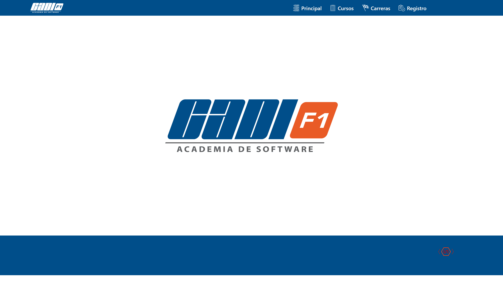
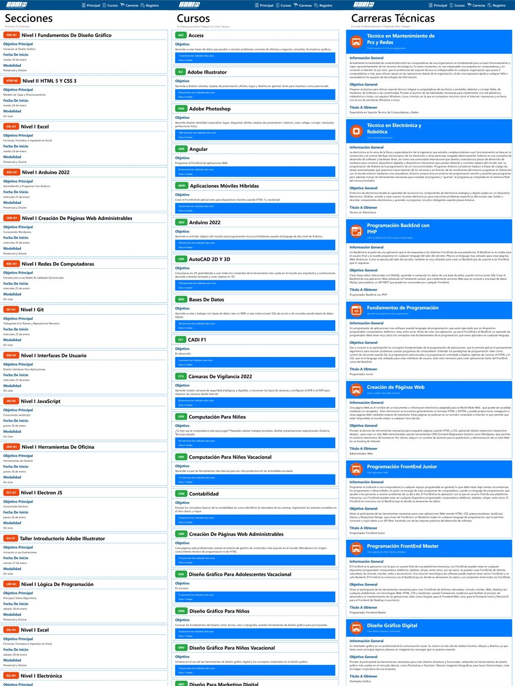
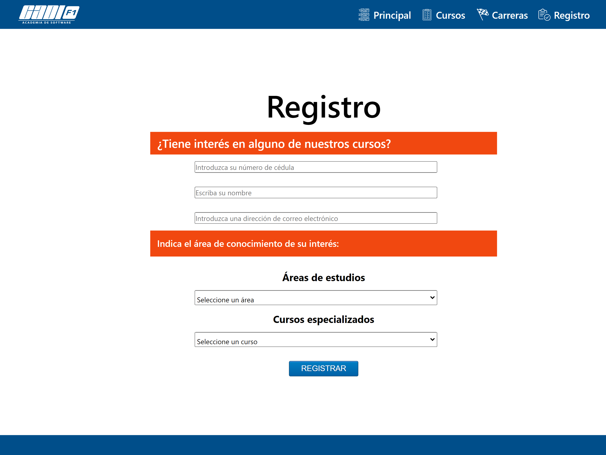

# CADIF1-Consult-Registers

FrontEnd Web alternative to the company CADI F1, using the data obtained from the API https://api.cadif1.com. An index file has been made that has a navbar with 4 options: Main, Courses, Careers and Registration, and an empty div. 4 additional HTML files were created for the index: one with the name sections.html to show the sections that are about to start, another with the name courses.html to show the courses taught by the academy, another with the name registration.html and another with the name career.html to display the career.

## Characteristics:

1. Using the **jQuery load method**, when clicking on its respective option *(Main -> sections.html, Courses -> courses.html, Careers -> careers.html, Registration -> registration.html)*, load in the empty div of the index, the **HTML** of each page, initially showing *(that is, in the ready of the index)* the content of the file sections.html. There are no traditional hyperlinks with the *"href" *attribute pointing to the HTML file because the HTML content must be displayed on each page without the URL changing in the browser.

2. Using **jQuery's getJson**, what returns the corresponding **ENDPOINT** is obtained and displayed on each page: in *sections.html* what returns https://api.cadif1.com/seccion, in *courses.html* what returns https://api. cadif1.com/curso y *carreras.html* (career) which returns https://api.cadif1.com/carrera.

3. The **HTML** file *registration.html* has been created that allows a student to register as interested in a course. In this file you must add an **HTML** form to request the student's personal data (ID, name and email) and have a *SELECT* the study areas available in the academy, in another *SELECT* the courses available in the academy. All this must be done using **jQuery's getJson** using the same **ENDPOINT** from feature 2.

4. It is validated that the form data is not empty before sending it. Show validation error messages with **SweetAlert**. When everything is valid, a *confirm* is displayed using **SweetAlert**. If the user answers yes, using the **jQuery $.post method**, the data is sent to the **ENDPOINT** https://api.cadif1.com/test.

5. It has been programmed that if the registration is successful, a success message is displayed and the form is cleared, but if the registration is not successful, an error message is displayed and the form is not cleared. Error messages are displayed using **SweetAlert**.